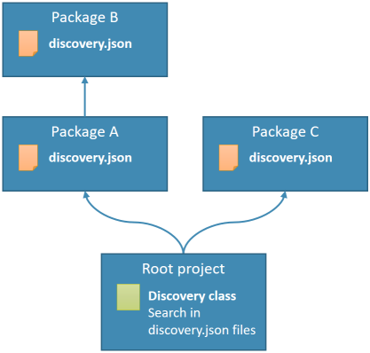

Default assets order
--------------------

While building `thecodingmachine/discovery`, a great deal of work has been done to make sure that assets are returned in a **useful** and **predictable** order.

<div class="alert alert-success">By default, assets are returned in <strong>an order respecting the dependencies between packages</strong>.</div>

If packages have no dependencies, they are returned in alphabetical order.

<div class="text-center">

</div>

In the example above, assets will be returned in this order:

- **Package B assets will be returned before Package A assets** (because of the dependency)
- Package C assets will be **returned last** (because of the alphabetical ordering)


Altering assets priority
------------------------

You can however alter this order using the `priority` modifier.

<div class="text-center"><code>discovery.json</code></div>
```json
{
    "some_asset_type": [
        {
            "value": "some_value",
            "priority": 99
        }
    ]
}
```

The default priority is 0.

Values with higher priorities will come first in the array.

Values with the same priority are ordered first by package dependency order, then by alphabetical order.
