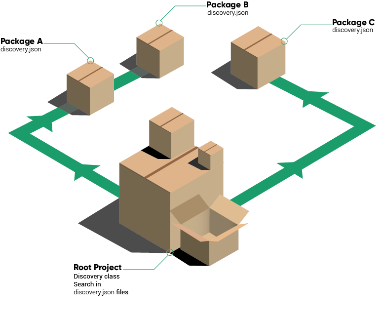

Sometimes, a package declares an asset but you actually want to ignore this asset in your project.

<div class="text-center">

</div>
<br/>
A package "A" can remove the assets added by another package "B" (assuming that package "A" requires "B").

To do so, use the `action` key:

<div class="text-center"><code>discovery.json</code> for package B</div>
```json
{
    "some_asset_type": "some_value"
}
```

<div class="text-center"><code>discovery.json</code> for package A</div>
```json
{
    "some_asset_type": [
        {
            "value": "some_value",
            "action": "remove"
        }
    ]
}
```

This will remove "some_value" from the asset type "some_asset_type".

<div class="alert alert-info">
Note that the root package of your project can also declare a <code>discovery.json</code> file. This is the best place to remove assets added by a package that you don't need.
</div>